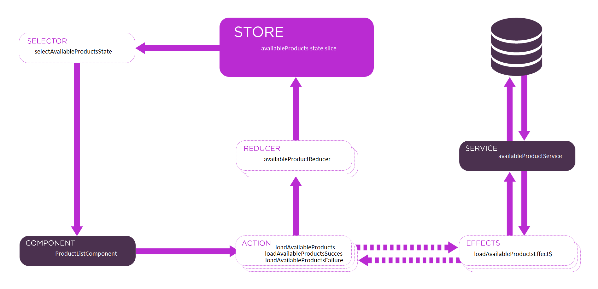
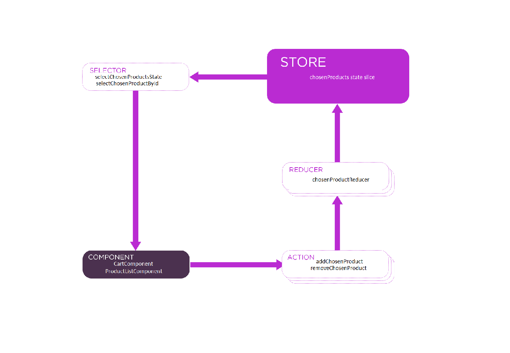

# Online Store Angular 17

This project was generated with [Angular CLI](https://github.com/angular/angular-cli) version 17.3.7.

## Development server

Run `ng serve` for a dev server. Navigate to `http://localhost:4200/`. The application automatically reloads if you change any of the source files.

## Code scaffolding

Run `ng generate component component-name` to generate a new component. You can also use `ng generate directive|pipe|service|class|guard|interface|enum|module`.

## Build

Run `ng build` to build the project. The build artifacts will be stored in the `dist/` directory.

## Running unit tests

Run `ng test` to execute the unit tests via [Karma](https://karma-runner.github.io).

## Running end-to-end tests

Run `ng e2e` to execute the end-to-end tests via a platform of your choice. To use this command, you first need to add a package 
that implements end-to-end testing capabilities.

## Further help

To get more help on the Angular CLI use `ng help` or go check out the [Angular CLI Overview and Command Reference](https://angular.io/cli) page.


##   State Management with NgRx

The `src/app/state` folder contains the NgRx setup, including actions, reducers, selectors, and effects, as well as the AppState interface.


### AppState Interface

The `AppState` interface defines the structure of the application's state. It includes two slices of state: `availableProducts` and `chosenProducts`.

```typescript
export interface AppState {
  availableProducts: AvailableProduct[];
  chosenProducts: ChosenProduct[];
}
```


An AvailableProduct represents products available for purchase. 



A ChosenProduct represents products that have been added to the cart.




### NgRx Initialization and Configuration

NgRx is initialized and configured in `src/main.ts`. This is done by creating an extended Application Config object containing
what is needed for NgRx initialization. It's then used when the application is bootstrapped. 

```typescript
const extendedAppConfig = {
    // ...original config plus what's needed for NgRx 
};
bootstrapApplication(AppComponent, extendedAppConfig);

```


NgRx actions are configured in the NgRx Store module of the application. The actions are connected to effects and reducers, 
which handle the side effects and state changes associated with these actions.  To accomplish this, the 
extended application configuration includes the original configuration and adds the necessary providers for NgRx Store and 
Store DevTools. 

```typescript
const extendedAppConfig = {
  ...appConfig, // original config
  providers: [
    ...appConfig.providers, // original providers
    importProvidersFrom(
      StoreModule.forRoot({
        chosenProducts: chosenProductReducer,
        availableProducts: availableProductReducer
      }),
      EffectsModule.forRoot([
        AvailableProductEffects
      ]),
      StoreDevtoolsModule.instrument())]};

```

Importing NgRx StoreModule and StoreDevtoolsModule at the application
level ensures that the state management is properly configured. Since
standalone components do not support 'Module.forRoot()' style
configurations directly in their imports array, these configurations 
must be applied at the bootstrap level. This approach integrates NgRx
store management and dev tools, providing a centralized state 
management solution for the application.


StoreModule.forRoot() configures the NgRx Store state management using
a configuration object to define the state slices and their reducers,
thereby managing how the state slices are updated in response to
actions. State slices are defined in the AppState interface, found in
the src/app/state/app.state.ts file. Reducer functions are defined in
the reducer files, found in the src/app/state/reducers directory.
Property names must match property names in the AppState interface, 
and property values must be names of reducer functions that define how
state updates are handled.


### NgRx Actions 

Actions are declarative programming. You state what action is to happen, not how it is to happen. 
To get NgRx to do an action you have to dispatch the action. When you dispatch it, you can optionally provide data in the form of a "payload".

#### `available-product.actions.ts`

This file defines the actions related to available products.

**Actions**:
1. **Load Available Products**: 
   - **Payload**: None
   - **Description**: Action to load the list of available products.

2. **Load Available Products Success**: 
   - **Payload**: An array of available products
   - **Description**: Action dispatched when the available products are successfully loaded.

3. **Load Available Products Failure**: 
   - **Payload**: Error information
   - **Description**: Action dispatched when there is an error loading the available products.

**Dispatch**: 


When loadAvailableProducts is dispatched in the AppComponent's ngOnInit function, the following sequence of events occurs:

1. Component Initialization: When the application starts, the AppComponent ngOnInit lifecycle hook is triggered.

1. Dispatch: The loadAvailableProducts action is dispatched to the NgRx Store. 

1. Action Handled by Effects: The dispatched action is then intercepted by an NgRx effect middleware, which listens for the loadAvailableProducts, and performs 
asynchronous operations needed to fetch available product data.

1. Resulting Actions: Once the asynchronous operations are complete, the effect will dispatch a new action to the NgRx Store with the result of the operation. 

1. Reducer Updates State: The success or failure action dispatched by the effect is then handled by a reducer, based on the action's type and payload. 

1. State Change Reflected in Application: Any components or services that have subscribed to the part of the state updated by the reducer will receive the new state. 


#### `chosen-product.actions.ts`  

This file defines the actions related to chosen products in the NgRx Store.


**Actions**:
1. **Add Chosen Product**:
   - **Payload**: A chosen product object
   - **Description**: Action to add a product to the list of chosen products.

2. **Remove Chosen Product**: 
   - **Payload**: The ID of the chosen product to be removed
   - **Description**: Action to remove a product from the list of chosen products.


These actions are dispatched wherever chosen products need to be manged. This includes the product list page, and the shopping cart.


### NgRx Reducers

Reducers handle the state transformations based on the actions dispatched. The updated state is then consumed by various components through selectors.

Reducers are functions that specify how the application's state changes in response to actions. Reducers subscribe to specific actions using the NgRx on() function.
Reducers compute and return a new value of state for each action that they operate on. Each reducer is responsible for a specific state slice, 
and is configured in  main.ts using StoreModule.forRoot()


##### availableProductReducer
The availableProductReducer subscribes to these actions: 

- loadAvailableProductsSuccess, dispatched by loadAvailableProductsEffect$ upon successfully loading available products. This action's payload 
becomes the new available products state slice. 
- loadAvailableProductsFailure, dispatched by loadAvailableProductsEffect$ upon failure. This action's payload is an error message.
- loadAvailableProducts, dispatched at the start of the app to fetch available products from an external source. The work is done by loadAvailableProductsEffect$
which is also subscribed to the same action. The reducer does nothing at the moment when this action is triggered. It's just a placeholder for potential future
 development that may fine tune the user experience during the potentially long-running async fetch. For example, a loading message could be displayed.

##### chosenProductReducer
The chosenProductReducer subscribes to these actions: 

- addChosenProduct, dispatched whenever the user wants to add a product to the shopping cart. This action's payload is the product data to be added.
- removeChosenProduct, dispatched whenever the user wants to remove a product from the shopping cart. This action's payload is the ID of the product 
to be removed.


### NgRx Selectors

Selectors are used to query the state. They are built using the NgRx createFeatureSelector function. "Feature" refers to the state slice that is queried. 
The portion of the state, the state slice, is identified using the the AppState 
 interface definition's property name. This property name is used during NgRx state configuration in the StoreModule.forRoot() method.

| selector | state slice | description |
|----------|----------|----------|
| selectAvailableProductsState    | availableProducts     | Returns all available products.     |
| selectAvailableProductById    | availableProducts     | Returns an available product given its ID.     |
| selectChosenProductsState    | chosenProducts     | Returns all avachosenilable products.     |
| selectChosenProductById    | DchosenProductsata     | Returns an chosen product given its ID.     |

### NgRx Effects

Effects handle side effects such as API calls. By subscribing to actions,  the NgRx effect middleware 
listens for the a specific action, and performs the required asynchronous operations needed to satisfy the action.

#####  loadAvailableProductsEffect$

The loadAvailableProductsEffect$ effect listens for loadAvailableProducts actions,
 calls the availableProductService.getAll() method when such an action is dispatched,
 and then dispatches either a loadAvailableProductsSuccess action (if the service call 
 is successful) or a loadAvailableProductsFailure action (if the service call fails).


###  Unit Testing

#### Configuration of Unit Testing  

Unit testing is configured in `tsconfig.spec.json` and uses Karma/Jasmine for to run the unit tests.

```json
{
  "extends": "./tsconfig.json",
  "compilerOptions": {
    "outDir": "./out-tsc/spec",
    "types": [
      "jasmine"
    ]
  },
  "include": [
    "src/**/*.spec.ts",
    "src/**/*.d.ts"
  ]
}
```


